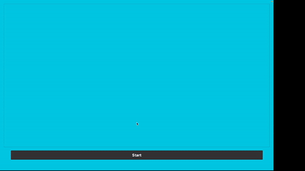

### README: Project Setup and Execution Guide

#### Prerequisites:

- Git (for cloning the repository)
- Python 3.8 or higher
- pip (Python package installer)
- Prolog interpreter (SWI-Prolog recommended)

#### Cloning the Repository:

To clone the repository, open a terminal (or Command Prompt on Windows) and run the following command:

```
git clone https://github.com/Ajodo-Godson/CS152_LBA
cd CS152_LBA
```

#### Installing Dependencies:

1. **Python Dependencies:**
   You can create a virtual environment to run the application by running the following command:

   ```
   python -m venv venv
   ```

   This will create a virtual environment in the `venv` folder.
   Activate the virtual environment by running the following command:
   **macOS**

   ```
   source venv/bin/activate
   ```

   **windows**

   ```
   venv\Scripts\activate
   ```

   Navigate to the project directory where `requirements.txt` is located and run the following command to install the required Python packages:

   **macOS and Windows:**

   ```
   pip install -r requirements.txt
   ```

2. **Prolog:**
   - **macOS:** Install SWI-Prolog using Homebrew:
     ```
     brew install swi-prolog
     ```
   - **Windows:** Download and install from [SWI-Prolog's website](https://www.swi-prolog.org/Download.html).

#### Running the Application:

1. **Prolog Knowledge Base:**
   Ensure that the Prolog knowledge base file (`kb.pl`) is in the project directory.

2. **Python GUI Application:**
   - Run the GUI application by executing the Python script:
     ```
     python gui2.py
     ```

## Notes:

- Make sure all file paths in your Python code are correctly configured, especially if your Python script references other files or directories.
- If you encounter any issues with PyQt dependencies, verify that you have a compatible version of Qt installed on your system.

### Errors and Troubleshooting:

- If you encounter an error with the pyswip's prolog.py module, navigate to 'venv/lib/python3.9/site-packages/pyswip/core.py' and change `PL_version = \_lib.PL_version ` to ` PL_version = \_lib.PL_version_info` and save. This should resolve the issue on both Mac and Windows.

- If you encounter an error like "FATAL ERROR: System Resources not found" or something similar, get the bin path of your SWI-PROLOG.
  It's usually: "C:\\Program Files\\swipl\\bin". Add it to your PATH environment variable.
  In the gui2.py, add these lines before importing the libraries:

  ```
  import os
  os.environ['SWI_HOME_DIR'] = "C:\\Program Files\\swipl"

  \\Then other imports and codes
  ```

  Run the gui2.py again -> It should be working now.


